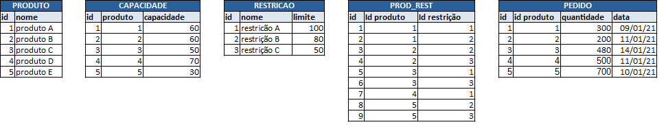

# Teste Prático Delphi

Construir uma aplicação Desktop para processamento de informações (semelhante a um Solver).

Data base inicial: 01/01/2020.
As informações de capacidade e limite são diárias.
Dada a estrutura a seguir:

## Especificações
 - Desenvolver CRUD para as entidades. Utilizar banco de dados de sua escolha (preferencialmente Oracle);
 - Popular as entidades com as informações acima;
 - Desenvolver rotina que importe apenas a Entidade PEDIDO de um arquivo, estruturado de sua preferência (txt, piped, json, xml, csv, etc);
 - Desenvolver rotina que processará a Entidade PEDIDO, distribuindo as quantidades dos produtos diariamente (desconsiderar sábados e domingos), sempre respeitando as quantidades de capacidade e restrições. O objetivo é encontrar uma distribuição que permita alocar todos pedidos para que sua quantidade seja produzida pelo menos até o dia ANTERIOR a data do pedido;
 - Desenvolver relatório exemplificando a forma como foi distribuído;
 - Caso não seja possível tal distribuição, o relatório deverá mostrar qual pedido terá sua data alterada, e mostrar qual a data nova encontrada;
 - A rotina de distribuição deverá salvar as informações em outra entidade (estruturada a sua escolha);
 - A aplicação deverá ter uma opção para reprocessar a entidade PEDIDO conforme pedidos novos forem sendo cadastrados/importados;
 - O processamento pode ser realizado na aplicação e/ou banco de dados;
 - O projeto deverá ter um readme explicando a estrutura, configuração necessária e como testar
 - A entrega deverá ser feita via repositório compartilhado (github, gitlab, etc), via ZIP por e-mail ou link para download.
